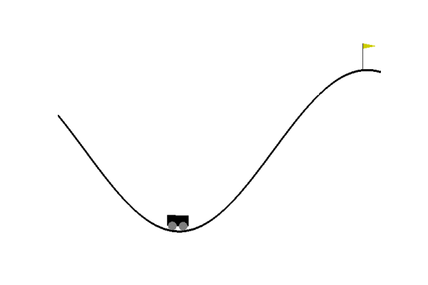

# Intrinsic motivation
Comparative study of intrinsic motivations on the MountainCar-v0 environment with QR-DQN as a base algorithm

| Pure QR-DQN | Forward Dynamics | Inverse Dynamics | ICM | RND |
| --- | --- | --- | --- | --- |
|  |  |  |  |  |

##### Related papers: 

[Burda, Yuri et al. "Exploration by Random Network Distillation" (2018)](https://arxiv.org/abs/1810.12894)

[Pathak, Deepak et al. "Curiosity-driven Exploration by Self-supervised Prediction" (2017)](https://arxiv.org/abs/1705.05363)

##### The QR-DQN code is based on the folowing repository: 

Arsenii Ashukha, Mikhail Konobeev. "Quantile Regression DQN a Minimal Working Example." https://github.com/ars-ashuha/quantile-regression-dqn-pytorch. (2018). 